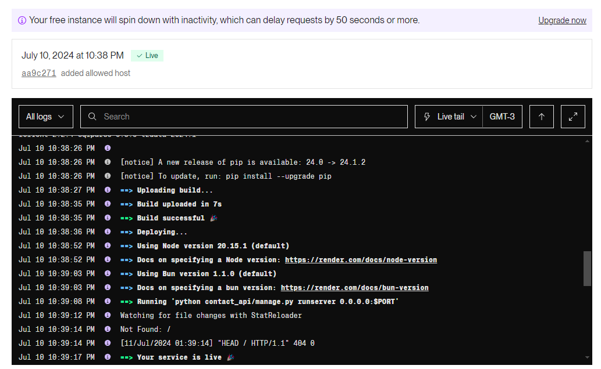

    
Trabajo Práctico Final Desarrollo Web Python, Django, SQL. Full Stack Python - Comisión 24150, CaC.

 - *nota:* Si la api no responde, se debe esperar alrededor de 50 segundos para que se reactive Render.
 - *front:* [repo](https://github.com/angel-farina/CaC-FSP-TP-WebTechSoluciones) - [netlify](https://webtechsoluciones.netlify.app/)

# WebTechSoluciones - Backend - Documentación Técnica

## Estructura del Proyecto

El proyecto `contact_api` sigue una estructura estándar de Django, con los siguientes archivos y directorios principales:

### Proyecto Django (`contact_api`):

- **asgi.py:** Punto de entrada para servidores ASGI compatibles.
- **settings.py:** Configuraciones del proyecto, incluyendo configuraciones de base de datos y aplicaciones instaladas.
- **urls.py:** Define las rutas de la aplicación y las vincula con las vistas correspondientes.
- **wsgi.py:** Punto de entrada para servidores WSGI compatibles.

### Aplicación Django (`contacts`):

- **migrations/:** Directorio que contiene las migraciones de la base de datos.
- **admin.py:** Configuraciones de administración del panel de Django.
- **apps.py:** Configuraciones de la aplicación.
- **models.py:** Definiciones de los modelos de datos utilizados en la aplicación.
- **serializers.py:** Serializadores para convertir modelos en JSON y viceversa.
- **tests.py:** Archivos de pruebas para la aplicación.
- **views.py:** Vistas que manejan las solicitudes HTTP y contienen la lógica de negocio.

### Otros Archivos:

- **contacto.sqlite3:** Base de datos SQLite utilizada por defecto en Django.
- **manage.py:** Utilizado para administrar el proyecto Django, ejecutar comandos de administración y realizar tareas como migraciones de base de datos.

## Funcionalidades Clave

- **Gestión de Contactos a través de una API REST:** El backend permite realizar operaciones CRUD (Crear, Leer, Actualizar, Eliminar) sobre los contactos almacenados en la base de datos. Las rutas correspondientes se definen en `urls.py` y se manejan mediante vistas genéricas en `views.py`.

- **Autenticación de Usuarios:** Se proporciona un endpoint para verificar las credenciales de los usuarios. La función `verify_user` en `views.py` maneja las solicitudes POST, verificando el nombre de usuario y la contraseña contra los datos almacenados en el modelo `UserCredentials`. Si las credenciales son correctas, se devuelve una respuesta positiva.

- **Implementación de CRUD para Datos de Contacto:** Utilizando Django REST Framework, se han creado las vistas `ContactListCreate` y `ContactRetrieveUpdateDestroy` que permiten listar, crear, actualizar y eliminar contactos. Los serializadores en `serializers.py` se encargan de convertir los datos del modelo a JSON y viceversa.

- **Uso de Django ORM para la Interacción con la Base de Datos:** Django ORM (Object-Relational Mapping) facilita la interacción con la base de datos SQLite. Los modelos definidos en `models.py` representan las tablas en la base de datos y las migraciones se utilizan para aplicar cambios en la estructura de la base de datos.

## Tecnologías Utilizadas

- **Python:** Lenguaje de programación utilizado para el desarrollo.
- **Django:** Framework web utilizado para construir la aplicación backend.
- **SQLite:** Sistema de gestión de base de datos relacional utilizado para el almacenamiento de datos.

## Colaboradores

- **Angel Farina**
- **Diego Capdevila**
- **Jeremías Geminiani**
- **Arturo Villagran**

## Muestra

## Deploy
[Render](https://cac-fsp-backend-tp-webtechsoluciones.onrender.com)

## Final

Esta documentación técnica proporciona una visión general de la estructura del proyecto, las funcionalidades implementadas, las tecnologías utilizadas y los colaboradores involucrados en el desarrollo del backend de WebTechSoluciones.
